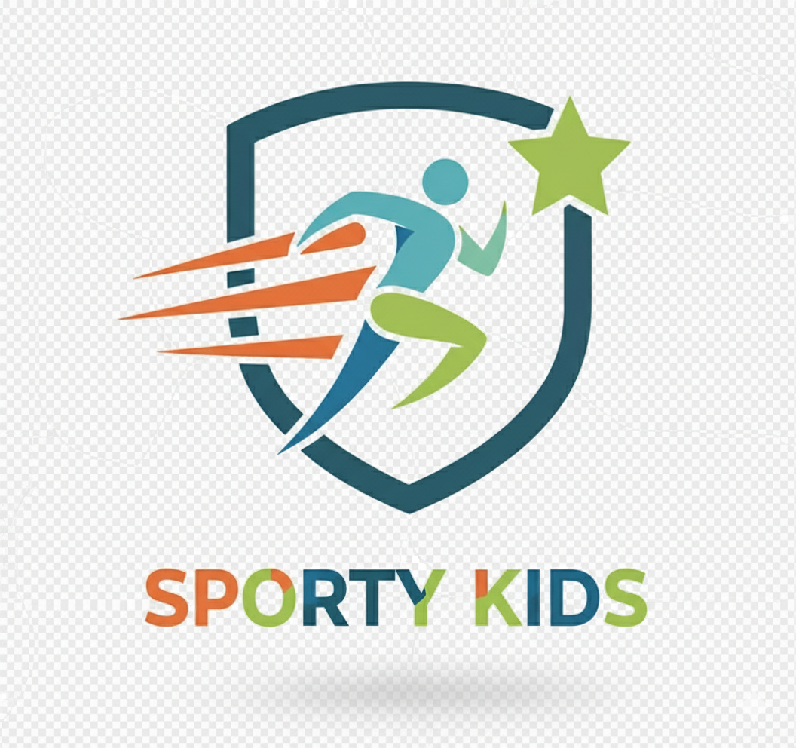
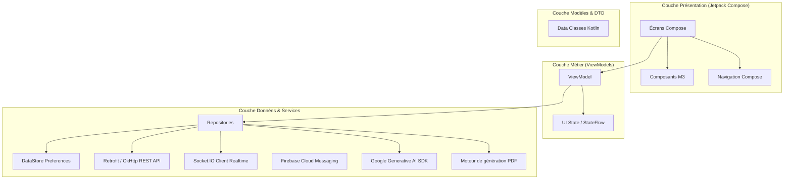

# 📱 SportKids — Sporty Kids

<p align="center">
  
</p>

<h3 align="center">Plateforme Mobile Intelligente de Gestion d'Académie Sportive pour Enfants</h3>

<p align="center">
  Application Android native développée en <b>Kotlin</b> avec <b>Jetpack Compose</b> et l'architecture moderne <b>MVVM</b>.
</p>

<p align="center">
  <a href="https://kotlinlang.org"></a>
  <a href="https://developer.android.com/jetpack/compose"></a>
  <a href="https://m3.material.io/"></a>
  <a href="https://ai.google.dev/"></a>
  <a href="https://stripe.com"></a>
  <a href="https://firebase.google.com"></a>
</p>

---

## 🌟 Présentation Générale

**Sporty Kids** est une application mobile Android de dernière génération conçue pour moderniser et simplifier la gestion quotidienne d'une académie sportive. 

Elle connecte harmonieusement les **parents**, les **entraîneurs (coachs)** et l'**administration** en offrant une expérience interactive, réactive et sécurisée. De l'inscription aux entraînements jusqu'au suivi des compétitions et au paiement en ligne, l'application intègre également des technologies de pointe telles que l'**Intelligence Artificielle générative Google Gemini**, les **appels audio/vidéo intégrés**, et la **génération automatique de bilans PDF**.

---

## 🎯 Objectif de l'Application

Faciliter la gestion globale d’une académie sportive afin d’offrir une expérience fluide, collaborative et transparente :
- **Pour les Parents** : Suivre en temps réel l'évolution sportive et pédagogique de leurs enfants, gérer les inscriptions, payer en toute sécurité et communiquer directement avec les coachs.
- **Pour les Entraîneurs** : Évaluer les séances, noter la progression physique et motrice, générer des synthèses d'entraînement assistées par IA et gérer les feuilles de match.
- **Pour l'Administration** : Piloter les tournois, planifier les plannings et centraliser les flux financiers sans friction.

---

## 👥 Espaces Utilisateurs & Rôles

```
                       ┌───────────────────────────────┐
                       │     Sporty Kids Ecosystème    │
                       └──────────────┬────────────────┘
                                      │
         ┌────────────────────────────┼────────────────────────────┐
         │                            │                            │
         ▼                            ▼                            ▼
┌──────────────────┐        ┌──────────────────┐        ┌──────────────────┐
│   ESPACE PARENT  │        │   ESPACE COACH   │        │   ADMINISTRATION │
├──────────────────┤        ├──────────────────┤        ├──────────────────┤
│• Profil Enfants  │        │• Évaluation      │        │• Gestion Tournois│
│• Suivi progrès   │        │• Synthèse Gemini │        │• Brackets/Matchs │
│• Inscriptions    │        │• Feuilles Matchs │        │• Activités       │
│• Paiement Stripe │        │• Chat & Appels   │        │• Programmes      │
│• Reçus & Bilans  │        │• Envoi Bilans PDF│        │• Vue Globale     │
└──────────────────┘        └──────────────────┘        └──────────────────┘
```

---

## 🚀 Fonctionnalités Clés Détaillées

### 🏆 1. Gestion des Tournois & Compétitions
- **Création et Programmation** : Configuration des tournois (nom, discipline, tranches d'âge, règles, dates et lieux).
- **Arbre de Tournoi Dynamique (Bracket)** : Visualisation interactive de l'arbre d'élimination directe (quarts, demies, finale) accessible aux parents et coachs.
- **Gestion des Équipes & Inscriptions** : Composition des effectifs, attribution des capitaines et validation des listes de participants.
- **Feuille de Match en Temps Réel** : Arbitrage numérique, mise à jour des scores en direct, statut des rencontres et génération automatique des classements.

### 👶 2. Suivi Pédagogique & Fiches Enfants
- **Dossier Athlète Personnalisé** : Fiche complète de chaque enfant (photo, âge, catégorie sportive, mensurations, antécédents).
- **Évaluation Multidimensionnelle** : Notation par les coachs sur les compétences techniques, tactiques, l'assiduité et la condition physique.
- **Historique Évolutif** : Visualisation sous forme de métriques de la progression au fil des mois.

### 🤖 3. Assistant Intelligent Google Gemini AI
- **Génération de Bilans Pédagogiques** : Grâce au modèle Google Gemini 1.5, l'application analyse les notes du coach pour rédiger automatiquement un bilan bienveillant, professionnel et personnalisé.
- **Recommandations d'Entraînement** : Suggestions ciblées d'exercices à réaliser à la maison pour renforcer les points d'amélioration de l'enfant.

### 📄 4. Export PDF & Notification par Email
- **Moteur PDF Intégré (`PdfUtils`)** : Génération instantanée d'un rapport officiel haute résolution aux couleurs de l'académie SportyKids.
- **Distribution Directe par Email** : Envoi en un clic du rapport PDF aux adresses email des parents via le service de messagerie intégré.

### 💬 5. Communication Temps Réel & Appels
- **Chat Instantané (Socket.IO)** : Discussions directes parents-entraîneurs avec confirmation de lecture, statut de frappe (*typing indicator*) et réactions.
- **Appels Vocaux et Vidéo In-App (`CallActivity`)** : Passerelles d'appels intégrées avec gestion du microphone, haut-parleur et flux vidéo.
- **Notifications Push (Firebase Cloud Messaging)** : Alertes instantanées pour les convocations, les changements de planning ou les messages urgents.

### ⚽ 6. Gestion des Activités & Programmes
- **Catalogue des Disciplines** : Football, Basketball, Natation, Tennis, Athlétisme, Gymnastique, etc.
- **Planification des Séances** : Attribution des créneaux horaires, coachs référents et terrains d'entraînement.
- **Localisation Cartographique (OSMDroid)** : Carte OpenStreetMap interactive pour repérer l'emplacement exact des terrains et stades.

### 💳 7. Paiements & Abonnements Sécurisés
- **Intégration Stripe Native** : Utilisation du composant officiel `PaymentSheet` pour un paiement carte bancaire rapide et conforme PCI-DSS.
- **Gestion des Cotisations** : Règlement des forfaits mensuels, trimestriels ou des stages de vacances.
- **Historique & Reçus** : Suivi de chaque transaction avec statut immédiat.

### 📲 8. Widget Écran d'Accueil Android
- **Jetpack Glance** : Widget interactif Material 3 installable sur l'écran d'accueil pour consulter en un coup d'œil les prochains cours et les notifications de l'académie.

---

## 🏛️ Architecture Logicielle (MVVM Clean Architecture)

Le projet respecte rigoureusement les préconisations officielles de Google pour Android :



---

## 🛠️ Stack Technologique Complète

| Domaine | Technologie / Bibliothèque | Version | Rôle & Usage |
|---|---|---|---|
| **Langage** | **Kotlin** | `2.0.21` | Langage principal, coroutines et typage strict |
| **Toolchain** | **Java / JDK** | `17` | Environnement d'exécution Gradle & compilation Android |
| **Android SDK** | **Target / Compile** | `API 34` (Android 14) | Min SDK `API 24` (Android 7.0+) |
| **Framework UI** | **Jetpack Compose BOM** | `2024.10.00` | Interface déclarative réactive |
| **Design System** | **Material 3** | `1.3.x` | Composants UI modernes et thémage sombre/clair |
| **Navigation** | **Navigation Compose** | `2.7.7` | Graphe de navigation unifié |
| **Réseau HTTP** | **Retrofit + OkHttp** | `2.9.0 / 4.12.0` | Client REST, convertisseur Gson, Logging Interceptor |
| **WebSockets** | **Socket.IO Client** | `2.0.1` | Chat bidirectionnel et notifications temps réel |
| **Intelligence Artificielle** | **Google Generative AI** | `0.9.0` | Intégration Gemini pour l'analyse des progrès |
| **Paiement** | **Stripe Android SDK** | `21.5.0` | Intégration Stripe PaymentSheet |
| **Cloud & Auth** | **Firebase BOM** | `32.7.0` | Auth, Firestore, Cloud Messaging (FCM), Analytics |
| **Cartographie** | **OSMDroid Android** | `6.1.16` | Carte OpenStreetMap sans dépendance Google Maps payante |
| **Imagerie** | **Coil Compose** | `2.6.0` | Chargement asynchrone d'images et mise en cache |
| **Desktop Widget** | **Jetpack Glance** | `1.1.x` | Création de widgets d'écran d'accueil avec Compose |
| **Stockage Local** | **DataStore Preferences** | `1.0.0` | Stockage sécurisé des tokens JWT et de la session |
| **Documents** | **Android PdfDocument** | Natif | Création de fiches bilans sportives en PDF |

---

## 📂 Structure du Répertoire du Code

```text
app/src/main/java/com/example/dam_front/
├── DamApplication.kt                  # Initialisation applicative (Firebase, Stripe, notifications)
├── MainActivity.kt                    # Point d'entrée avec gestion de navigation globale
│
├── api/                               # Interfaces de communication HTTP Retrofit
│   ├── AuthApi.kt                     # Endpoints authentification, connexion et inscription
│   ├── TournoisApi.kt                 # Gestion des tournois, brackets et inscriptions
│   ├── ActivitiesApi.kt               # Gestion des activités sportives
│   ├── ProgramsApi.kt                 # Gestion des programmes d'entraînement
│   └── UserApi.kt                     # Profils utilisateurs et enfants
│
├── config/                            # Paramètres d'API et constantes serveur
│   └── ApiConfig.kt                   # URLs de base (Android Emulator vs Device Réel)
│
├── network/                           # Gestionnaire réseau HTTP & WebSockets
│   ├── RetrofitClient.kt              # Configuration OkHttp avec intercepteur JWT
│   └── SocketManager.kt               # Gestionnaire des connexions Socket.IO
│
├── repository/                        # Abstraction de la logique de données (Clean Repositories)
│   ├── AuthRepository.kt
│   ├── TournoisRepository.kt
│   ├── ChildRepository.kt
│   ├── ActivitiesRepository.kt
│   └── PaymentRepository.kt
│
├── viewmodels/                        # ViewModels MVVM orchestrant les états UI
│   ├── AuthViewModel.kt
│   ├── TournoisViewModel.kt
│   ├── CoachHomeViewModel.kt
│   ├── ParentHomeViewModel.kt
│   ├── ActivitiesViewModel.kt
│   └── ConversationViewModel.kt
│
├── models/                            # Modèles de données Kotlin (Entities & DTOs)
│   ├── User.kt, Child.kt
│   ├── Tournament.kt, Match.kt, Equipe.kt
│   └── Payment.kt, Activity.kt, Program.kt
│
├── ui/
│   ├── screens/                       # Plus de 40 écrans Compose complets
│   │   ├── SignInScreen.kt / SignUpScreen.kt
│   │   ├── ParentDashboardScreen.kt / MonEnfantScreen.kt
│   │   ├── CoachHomeScreen.kt / CoachCreateSuiviScreen.kt
│   │   ├── SuiviAiSummaryScreen.kt     # Écran bilan assisté par Gemini AI
│   │   ├── TournoisListScreen.kt / MatchManagementScreen.kt
│   │   ├── BracketParentScreen.kt     # Arbre interactif des tournois
│   │   ├── ChatScreen.kt / ContactListScreen.kt
│   │   └── ActivitiesListScreen.kt / ProgramDetailScreen.kt
│   │
│   ├── components/                    # Composants graphiques réutilisables (Cartes, Boutons, Badges)
│   ├── navigation/                    # Graphes de routes et barres de navigation
│   ├── theme/                         # Couleurs, Typographies et Formes Material 3
│   └── map/                           # Intégration OSMDroid pour la cartographie
│
├── call/ & calls/                     # Module d'appels audio et vidéo
│   ├── CallActivity.kt                # Activité dédiée aux appels temps réel
│   └── CallScreens.kt                 # Interface d'appel (Mute, Haut-parleur, Vidéo)
│
├── email/                             # Client et DTOs d'envoi d'emails (bilans sportifs)
│   ├── EmailRetrofitClient.kt
│   └── EmailRequest.kt
│
├── services/                          # Services système Android (FCM Messaging, etc.)
│   ├── MyFirebaseMessagingService.kt
│   └── SuiviGeminiService.kt          # Intégration directe de l'API Google Gemini
│
├── utils/                             # Boîte à outils
│   ├── PdfUtils.kt                    # Moteur de génération de bilans PDF SportyKids
│   ├── TokenManager.kt                # Gestion du jeton d'authentification Bearer
│   └── ImageUtils.kt / DateUtils.kt
│
└── widget/                            # Widget d'écran d'accueil avec Jetpack Glance
    ├── SportyWidget.kt
    └── SportyWidgetReceiver.kt
```

---

## ⚡ Guide d'Installation & Prise en Main

### 1. Prérequis Système
- **Android Studio** : Version Hedgehog, Iguana, Koala ou Ladybug
- **Java Development Kit (JDK)** : Version 17
- **SDK Android** : Android SDK 34 (Android 14) installé via le SDK Manager
- **Appareil cible** : Émulateur Android (ex: Pixel 7 avec Play Services) ou appareil physique sous Android 7.0+ avec débogage USB activé.

### 2. Récupération du Code
```bash
git clone -b frontend-android https://github.com/hadilaroua/SportKids.git
cd SportKids
```

### 3. Configuration de Firebase
- Placez votre fichier `google-services.json` généré depuis la console Firebase dans le répertoire `app/` du projet.
- Assurez-vous que le package name correspond à : `com.example.dam_front`.

### 4. Configuration de l'Adresse du Backend
Ouvrez le fichier de configuration réseau `app/src/main/java/com/example/dam_front/config/ApiConfig.kt` (ou `RetrofitClient.kt`) et adaptez l'adresse selon votre environnement :

```kotlin
// Pour un émulateur Android Studio officiel (adresse pointant vers la machine hôte) :
const val BASE_URL = "http://10.0.2.2:3000/"

// Pour un smartphone physique connecté au même réseau Wi-Fi :
// const val BASE_URL = "http://192.168.1.XX:3000/"
```

### 5. Compilation & Lancement
1. Ouvrez le projet dans Android Studio.
2. Effectuez une synchronisation Gradle : **File > Sync Project with Gradle Files**.
3. Lancez l'application en cliquant sur le bouton vert **Run 'app'** (`Shift + F10`).

---

## 🔒 Sécurité & Bonnes Pratiques

- **Authentification JWT** : Chaque requête aux API protégées est enrichie avec le token Bearer via un `OkHttp Interceptor`.
- **Règles Proguard / R8** : Obfuscation et minification configurées pour protéger les clés et les modèles en mode Release.
- **Conformité des Paiements** : Aucune donnée de carte bancaire ne transite par les serveurs de l'académie ; le flux est délégué directement aux serveurs sécurisés de Stripe.
- **Protection des Secrets** : Les clés privées et fichiers d'environnement sont exclus du suivi Git via `.gitignore`.

---

## 👨‍💻 Auteurs & Équipe

Développé avec passion pour moderniser le sport chez les jeunes athlètes.

- **Dépôt GitHub** : [hadilaroua/SportKids](https://github.com/hadilaroua/SportKids.git)
- **Branche Frontend** : [`frontend-android`](https://github.com/hadilaroua/SportKids/tree/frontend-android)
- **Branche Backend** : [`backend-android`](https://github.com/hadilaroua/SportKids/tree/backend-android)

---

<p align="center">
  <sub>SportKids © 2026 – Tous droits réservés.</sub>
</p>
